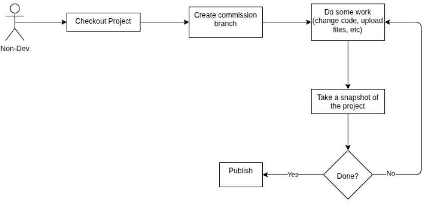

# GitBack Documentation

If you are an ASEI employee and have pressed the "Help" button, please review this documentation. If what you are looking for is not here, please reach out to Carter Dugan or Pat Santucci.

## Overview

GitBack is a tool designed for employees at American Sound who may need to use Git but are not in a developer role. This includes field engineers, service techs, and anyone else that might need to contribute to a codebase.

## Dependencies

You must have Git installed in order to use GitBack.

## Installation

You can install the latest version of GitBack by downloading the setup installer **(`GitBack_Setup_<version>.exe`)** from [here](https://github.com/American-Sound/GitBack/releases/latest) and then running the executable.

## Usage

The typical usage of GitBack is as follows:

1. The user needs to complete work.
2. The user checks out a project repository.
3. The user creates a branch for their work.
4. The user begins working, taking snapshots of their progress as they make progress.
5. When the user is finished working, they publish the changes they have made.

When you first install and launch GitBack, you will be taken to the [settings screen](./settings.md). Be sure to enter all required details and save in order to use the app.

## Navigation

Choose one of the following pages for documentation on whatever you need help with.

* [GitBack Settings](./settings.md)
* [Checking Out a Project](./checkout.md)
* [Managing a Project](./manage.md)
* [Developer Support Guide](./dev.md)
