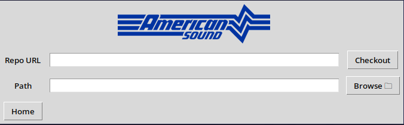

# Checking Out a Project

When you are ready to begin working on a project, the first thing you need to do is check it out. When you click **"Checkout Project"**, you will be greeted with this screen:

There are two ways to checkout a project:

1. Checkout a project that is not yet on your machine (or a project you have since deleted) by providing both a URL *and* a path.

2. Checkout a project that is already on your machine by only providing a path.

If you are checking out a project that is not yet on your machine (option 1), you must first grab the HTTP URL to the Git repository that holds the code you wish to modify or add to. Place that in the URL text box. Then, click **"Browse"** and navigate to the parent folder where you would like a new folder for the repository to be created and filled.

If you are checking out a project that is already on your machine (option 2), simply click **"Browse"** and navigate to the folder for the repository you wish to check out. When you select it, you will notice that the **"Repo URL"** is grayed-out and restricted from use. You will see a message that the selected path points to an existing repository.

When you are ready to check out your project, click **"Checkout"**. In most cases, **GitBack will hang temporarily while the project is being checked out, and this can take a few minutes**. This is normal. Git is processing the repository in the background. Once it is finished, you will see a success message. Your next step is to navigate to the [project management page](./manage.md).
