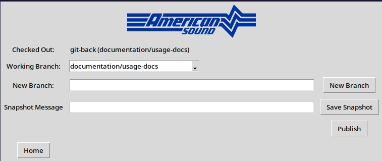

# Managing a Project

* [Creating a Branch](#creating-a-branch)
* [Taking Snapshots](#taking-snapshots)
* [Publishing](#publishing)

On the home screen, you can click **"Manage Project"** to get to the following screen.

If you don't have a project checked out, most of the fields and buttons will be disabled and you will not be able to interact with them.

If a project is checked out, you will see the project name and the current branch next to the **"Checked Out"** label. This is in the format `repo (branch)`. In the image above, I am in the `git-back` repository on the `documentation/usage-docs` branch. This is the branch I am currently working in as I write this documentation.

## Creating a Branch

If you are in the `main` branch, you will not be able to save any snapshots. **If you've already began working, don't panic**. You won't lose your changes and chances are you should be able to create a new branch just fine.

Type the name of your branch in the **"New Branch"** field. **The name can only consist of numbers, letters, and the following special characters: `._-/`**. Branch name can be anything, but it is good to **use a short name that briefly describes what you're working on**. A call number, for instance, would be great to call `call_<call number>` or something. Once you are done, click **"New Branch"**. After a brief pause, notice the success message and the new branch. Also note that the branch is prefixed with "commission-branch-", this is intentional.

You can now begin working.

## Taking Snapshots

As you work, it is a good idea to regularly take snapshots. These snapshots will be stored as points-in-time for the project and the work you do. I typically advise people to take a snapshot whenever they get a good chunk of work done that they can describe in a sentence. This is because snapshots require a message to describe what work was done.

When you take a snapshot, provide a message and keep it brief. **Remember: This is the breadcrumb trail that you or someone else might have to follow in the future to figure out what you were doing**. I don't advise using a throwaway message unless you are very short on time.

Once you are done working and have taken your final snapshot, you are ready to publish.

## Publishing

In order to publish, you must be on a commission branch and have at least one snapshot and no changes that are not included in the latest snapshot.

When you click **"Publish"**, your work is pushed to the remote version of the repository. **At this point, it is a good idea to create a pull request (PR)** unless the developer/owner of the repository has set up the process to have them created automatically. **You should also notify the dev that you have published changes**, this will allow them to keep their own work up to date and address your PR as soon as they are able. **If you are an American Sound employee**, you should follow [the internal documentation on creating a pull request in Azure DevOps](https://dev.azure.com/AmericanSound/ASEI/_wiki/wikis/ASEI.wiki/87/Pull-Requests).

It is worth noting that **you are still able to make changes, take snapshots, and publish your work even if a PR is currently open. The changes in the PR will be updated to reflect your new work each time you publish**.
