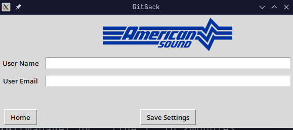

# GitBack Settings

The settings menu of GitBack has two fields:

* **User Name** - Your first and Last name, separated by a space

* **User Email** - Your email

These two fields are required. If they are not filled, you will not be able to return back to the home screen. **When you open GitBack for the first time and update or ignore updates, this will be the first page you see.**

When you click **"Save Settings"**, not only is your user name and email saved, but your Git configuration is tweaked automatically to match the required settings to contribute to ASEI projects. This is done invisibly in the background and happens each time you click "Save Settings".

If you click "Home", you will be brought back to the home screen and your settings will not be saved. If the proper settings are not yet saved, then the "Home" button will be unavailable.
